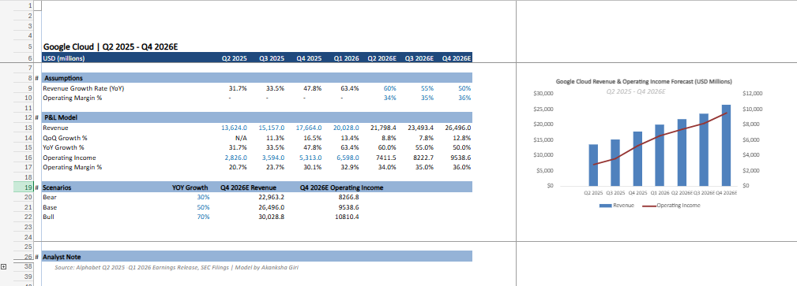

# Google Cloud Segment Analysis — FP&A Model & Forecast (2025–2026)

A segment-level P&L model built from scratch using official Alphabet Inc. 
earnings releases and SEC filings. Covers Google Cloud's financial performance 
from Q2 2025 to Q1 2026, with forward projections through Q4 2026 and 
scenario analysis across three growth assumptions.

## What This Model Covers

**Raw Data Tab**
- Quarterly Google Cloud Revenue and Operating Income sourced directly from 
  Alphabet SEC filings and earnings press releases (Q2 2024 — Q1 2026)

**Assumptions Block**
- Revenue Growth Rate (YoY) for projected quarters
- Operating Margin % for projected quarters
- All inputs clearly separated from calculated outputs

**P&L Model**
- Quarterly Revenue, Operating Income, and Operating Margin %
- QoQ Growth % and YoY Growth % across all periods
- Forward projections for Q2 2026E, Q3 2026E, Q4 2026E driven entirely by assumptions

**Scenario Analysis**
- Bear Case (30% YoY growth) — macro slowdown or intensified AWS/Azure competition
- Base Case (50% YoY growth) — current momentum continues
- Bull Case (70% YoY growth) — AI infrastructure demand accelerates

**Analyst Note**
- Written commentary on profitability trends, AI demand drivers, 
  forward projections, and key metrics to monitor

## Tools Used
- Microsoft Excel (Advanced)
- Data sourced from Alphabet Earnings Releases and SEC EDGAR (10-Q filings)
- Color-coded model: blue for hardcoded inputs, black for calculated outputs

## Key Skills Demonstrated
- Segment-level P&L construction from public filings
- Assumptions-driven financial modeling and forward projection
- Scenario analysis and sensitivity thinking
- SEC filing navigation and real data sourcing

## About
Built as a portfolio project targeting FP&A and product finance roles.
All data sourced directly from Alphabet Inc. official earnings releases
and SEC 10-Q filings — no third-party aggregators used.

---
*Model by Akanksha Giri*
*Data Source: Alphabet Inc. Earnings Releases & SEC EDGAR | Q2 2025 — Q1 2026*
